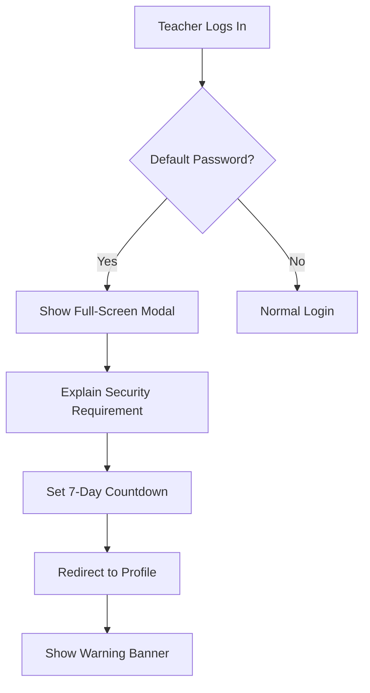
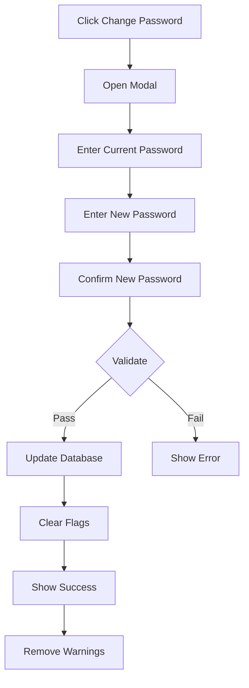
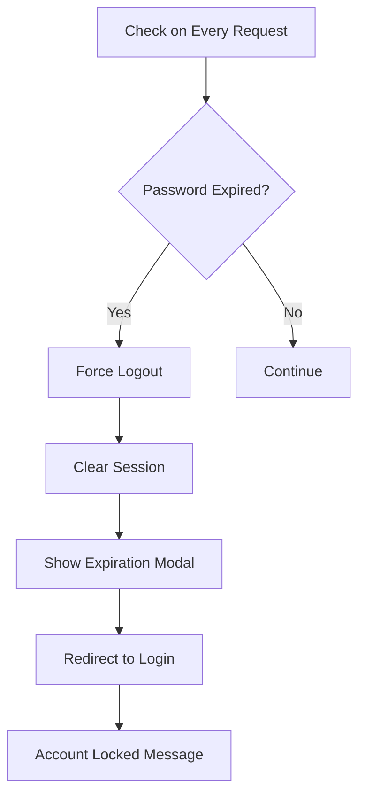

# Password Security System - Implementation Documentation

## 📋 Overview

This document outlines the implementation of a comprehensive password security system for the School Management Application. The system enforces mandatory password changes for teachers using default passwords, with automatic account suspension for non-compliance.

**Version:** 1.0  
**Date:** January 16, 2026  
**Status:** Implementation Required

---

## ⚠️ IMPORTANT: Current State

### ✅ What Already Exists and Works
The application **ALREADY HAS** a fully functional password change feature:
- **Location:** Teacher Profile → Password Change Modal
- **File:** `src/components/modals/TeacherPasswordModal.tsx`
- **API Endpoint:** `POST /api/teacher-portal/change-password`
- **Functionality:** Teachers can change their password anytime
- **Validation:** Minimum 6 characters, old password verification
- **Status:** ✅ **WORKING PERFECTLY**

### ❌ The Problem
Despite having a working password change feature, **almost all teachers are still using default passwords** (their phone numbers). They either:
- Don't know they should change their password
- Forget to change it
- Think it's optional
- Don't understand the security risk

### 🎯 What We're Building
We are **NOT** building a password change feature (it already exists!). Instead, we are building:
1. **Detection System** - Identify teachers still using default passwords
2. **Warning System** - Visual alerts to remind them to change password
3. **Enforcement System** - Mandatory 7-day deadline with auto-suspension
4. **Admin Management** - Tools to manage and monitor compliance
5. **Notification System** - Email/SMS reminders to drive adoption

**In summary:** We're adding enforcement and awareness on top of the existing, working password change feature.

---

## 🎯 Business Requirements

### Primary Objectives
1. **Security Enhancement**: Eliminate the use of default passwords (phone numbers) across all teacher accounts
2. **Compliance Enforcement**: Mandatory password change within 7 days of detection using the existing password change feature
3. **User Awareness**: Clear visual warnings and notifications for affected users
4. **Administrative Control**: Enable administrators to manage account security and password resets
5. **Automated Enforcement**: Automatic account suspension upon password expiration

### Security Rationale
- **Current Risk**: Teachers use their phone numbers as both username and password
- **Existing Solution**: Password change feature exists but is not being used
- **Vulnerability**: Predictable credentials increase unauthorized access risk
- **Mitigation**: Force use of existing password change feature with expiration mechanism

---

## 🔑 Core Features

### 1. Default Password Detection System

#### Detection Logic
```typescript
A password is considered "default" when:
- User.password (hashed) matches bcrypt hash of User.phone
- OR User.password matches bcrypt hash of Teacher.phone
- OR User.isDefaultPassword flag is TRUE
```

#### Database Schema Changes
**New fields in User table:**
```prisma
model User {
  // ... existing fields
  isDefaultPassword     Boolean   @default(true)
  passwordExpiresAt     DateTime?
  passwordChangedAt     DateTime?
  passwordResetToken    String?   @unique
  passwordResetExpiry   DateTime?
  accountSuspendedAt    DateTime?
  suspensionReason      String?
}
```

---

### 2. Password Expiration Warning System

#### Warning Stages

| Stage | Days Remaining | Alert Level | UI Indicator | Action Required |
|-------|---------------|-------------|--------------|-----------------|
| **Critical** | 0-2 days | 🔴 Red | Prominent banner + Modal on login | Immediate |
| **Urgent** | 3-4 days | 🟡 Orange | Banner under profile | High Priority |
| **Notice** | 5-7 days | 🔵 Blue | Subtle notification | Medium Priority |

#### Visual Implementation

**Profile Screen Warning (Under Profile Picture):**
```
┌─────────────────────────────────────────┐
│   [Profile Picture]                      │
│   Teacher Name                           │
│                                          │
│  ⚠️ PASSWORD SECURITY WARNING            │
│  ━━━━━━━━━━━━━━━━━━━━━━━━━━━━━━━━━      │
│  Your account is using a default         │
│  password. For security reasons, you     │
│  must change your password within:       │
│                                          │
│        🕐 3 Days 5 Hours                 │
│                                          │
│  [Change Password Now] [Remind Me Later]│
│                                          │
│  Note: Clicking "Change Password Now"    │
│  opens the existing password change      │
│  modal that's already in your profile.   │
└─────────────────────────────────────────┘
```

#### Notification Behavior
- **First Login**: Show full-screen modal explaining the requirement
- **Subsequent Logins**: Show banner warning with countdown
- **Final 24 Hours**: Show blocking modal on every screen navigation
- **Expired**: Immediate logout with explanation modal

---

### 3. Automatic Account Suspension

#### Suspension Trigger
```
IF currentDate >= passwordExpiresAt AND isDefaultPassword === true
THEN
  - Set User.isActive = false
  - Set User.accountSuspendedAt = NOW()
  - Set User.suspensionReason = "Password change deadline exceeded"
  - Force logout all active sessions
  - Send email/SMS notification to user and admin
END
```

#### Grace Period Configuration
- **Initial Detection**: Set `passwordExpiresAt = NOW() + 7 days`
- **Warning Period**: 7 days from detection
- **Extension Option**: Admins can extend by 3/7/14 days
- **Maximum Extension**: 30 days total

---

### 4. Admin Management Features

#### Admin Dashboard - Teacher Security Panel

**Location:** `/admin/security/teachers`

**Features:**

##### 4.1 Overview Dashboard
```
┌─────────────────────────────────────────────────┐
│ 📊 Password Security Status                     │
├─────────────────────────────────────────────────┤
│ 🔴 Critical (0-2 days):     12 teachers         │
│ 🟡 Urgent (3-4 days):       28 teachers         │
│ 🔵 Notice (5-7 days):       45 teachers         │
│ ✅ Secure (changed):        215 teachers        │
│ 🔒 Suspended (expired):     5 teachers          │
├─────────────────────────────────────────────────┤
│ Total Teachers: 305                              │
│ Compliance Rate: 70.5%                          │
└─────────────────────────────────────────────────┘
```

##### 4.2 Teacher Account Management Table
```
╔════════════════════════════════════════════════════════════════╗
║ Teacher Name    │ Status    │ Expires In │ Actions            ║
╠════════════════════════════════════════════════════════════════╣
║ John Smith      │ 🔴 Critical│ 1 day     │ [Reset] [Extend]  ║
║ Mary Johnson    │ 🟡 Urgent  │ 3 days    │ [Reset] [Extend]  ║
║ Peter Wong      │ 🔒 Suspended│ Expired   │ [Activate] [Reset]║
║ Sarah Lee       │ ✅ Secure  │ N/A       │ [Reset]           ║
╚════════════════════════════════════════════════════════════════╝
```

##### 4.3 Admin Actions

**A. Force Password Reset**
- Generate temporary password
- Send via email/SMS to teacher
- Set `isDefaultPassword = true` and new expiration
- Log action in audit trail

**B. Extend Expiration**
- Options: +3 days, +7 days, +14 days
- Require reason for extension
- Notify teacher of extension
- Log action in audit trail

**C. Account Suspension (Manual)**
- Toggle `isActive` status
- Require reason for suspension/activation
- Immediate logout of affected user
- Send notification
- Log action in audit trail

**D. Bulk Operations**
- Select multiple teachers
- Apply same action to all selected
- Confirmation modal with summary
- Email/SMS notification to all affected

##### 4.4 Audit Trail
```
Date/Time         | Admin    | Action        | Teacher      | Details
------------------|----------|---------------|--------------|------------------
2026-01-16 14:30  | Admin1   | Password Reset| John Smith   | Forgot password
2026-01-15 09:15  | Admin1   | Extend +7 days| Mary Johnson | Medical leave
2026-01-14 16:45  | Admin2   | Suspend       | Peter Wong   | Security violation
2026-01-13 11:20  | Admin1   | Activate      | Sarah Lee    | Issue resolved
```

---

### 5. Mobile PWA Implementation

#### Responsive Design Requirements

**Mobile View (< 768px):**
```
┌─────────────────────┐
│  [=] School Logo    │ ← Header
├─────────────────────┤
│  ⚠️ PASSWORD ALERT  │ ← Sticky Warning
│  Change in 3 days   │
│  [Change Now]       │
├─────────────────────┤
│   [Profile Pic]     │
│   Teacher Name      │
│   Position          │
├─────────────────────┤
│ 📧 Contact Info     │
│ 📊 Stats            │
│ 📚 Classes          │
└─────────────────────┘
```

#### PWA-Specific Features
- **Push Notifications**: Daily reminders (days 7, 5, 3, 1)
- **Offline Support**: Cache expiration status, show warning offline
- **Background Sync**: Check expiration on app resume
- **Home Screen Badge**: Show notification count

---

## 🔐 Security Specifications

### Password Requirements (Enhanced)

**Minimum Criteria:**
- Length: 8 characters minimum (increased from 6)
- Must include:
  - At least 1 uppercase letter
  - At least 1 lowercase letter
  - At least 1 number
  - At least 1 special character (!@#$%^&*)
- Cannot be same as phone number
- Cannot be same as email
- Cannot contain user's name
- Cannot be previous 3 passwords

### Password Strength Indicator
```
Weak:     ████░░░░░░ (< 40%)  - Red
Fair:     ██████░░░░ (40-60%) - Orange
Good:     ████████░░ (60-80%) - Yellow
Strong:   ██████████ (80%+)   - Green
```

### Encryption & Storage
- **Algorithm**: bcrypt with salt rounds = 12 (increased from 10)
- **Storage**: Never store plaintext passwords
- **Transmission**: HTTPS only, no password in URLs/logs
- **History**: Store hashed previous passwords for comparison

---

## 📱 User Experience Flow

### First-Time Login After Implementation



### Password Change Flow



### Auto-Logout Flow



---

## 🔄 API Endpoints

### New Endpoints Required

#### 1. Check Password Status
```http
GET /api/auth/password-status
Authorization: Bearer {token}

Response:
{
  "isDefaultPassword": true,
  "passwordExpiresAt": "2026-01-23T23:59:59Z",
  "daysRemaining": 3,
  "hoursRemaining": 14,
  "alertLevel": "urgent",
  "canExtend": false
}
```

#### 2. Change Password (✅ Already Exists - Minor Enhancement)
```http
POST /api/teacher-portal/change-password
Authorization: Bearer {token}

Request:
{
  "oldPassword": "currentPass",
  "newPassword": "NewSecure123!",
  "confirmPassword": "NewSecure123!"
}

Response (ENHANCED to include security flags):
{
  "success": true,
  "message": "Password changed successfully",
  "isDefaultPassword": false,           // NEW FIELD
  "passwordChangedAt": "2026-01-16T18:30:00Z"  // NEW FIELD
}

Note: This endpoint ALREADY EXISTS and works fine.
We only need to ADD the new fields to the response and update
the User record to set isDefaultPassword=false when password is changed.
```

#### 3. Admin Force Password Reset
```http
POST /api/admin/teachers/{teacherId}/reset-password
Authorization: Bearer {adminToken}

Request:
{
  "reason": "Teacher forgot password",
  "sendNotification": true,
  "expirationDays": 7
}

Response:
{
  "success": true,
  "temporaryPassword": "Temp123!xyz",
  "expiresAt": "2026-01-23T23:59:59Z",
  "notificationSent": true
}
```

#### 4. Admin Extend Expiration
```http
POST /api/admin/teachers/{teacherId}/extend-expiration
Authorization: Bearer {adminToken}

Request:
{
  "extensionDays": 7,
  "reason": "Medical leave"
}

Response:
{
  "success": true,
  "previousExpiration": "2026-01-18T23:59:59Z",
  "newExpiration": "2026-01-25T23:59:59Z",
  "totalExtensionDays": 7
}
```

#### 5. Admin Account Management
```http
PATCH /api/admin/teachers/{teacherId}/account-status
Authorization: Bearer {adminToken}

Request:
{
  "isActive": false,
  "reason": "Security violation",
  "notifyUser": true
}

Response:
{
  "success": true,
  "teacherId": "teacher_123",
  "isActive": false,
  "suspendedAt": "2026-01-16T18:30:00Z",
  "reason": "Security violation"
}
```

#### 6. Get Security Dashboard Data
```http
GET /api/admin/security/dashboard
Authorization: Bearer {adminToken}

Response:
{
  "statistics": {
    "total": 305,
    "critical": 12,
    "urgent": 28,
    "notice": 45,
    "secure": 215,
    "suspended": 5,
    "complianceRate": 70.5
  },
  "teachers": [
    {
      "id": "teacher_123",
      "name": "John Smith",
      "email": "john@school.com",
      "phone": "855123456",
      "isDefaultPassword": true,
      "passwordExpiresAt": "2026-01-17T23:59:59Z",
      "daysRemaining": 1,
      "alertLevel": "critical",
      "isActive": true,
      "lastLogin": "2026-01-16T10:30:00Z"
    }
  ]
}
```

---

## 🎨 UI Components Specifications

### 1. Profile Warning Banner Component

**File:** `src/components/security/PasswordExpiryWarning.tsx`

**Props:**
```typescript
interface PasswordExpiryWarningProps {
  daysRemaining: number;
  hoursRemaining: number;
  alertLevel: 'critical' | 'urgent' | 'notice';
  onChangePassword: () => void;
  onDismiss?: () => void;
}
```

**Visual Variants:**

```tsx
// Critical (0-2 days)
<div className="bg-red-50 border-2 border-red-500 rounded-lg p-4">
  <div className="flex items-start">
    <AlertTriangle className="text-red-600 h-6 w-6" />
    <div className="ml-3 flex-1">
      <h3 className="text-red-800 font-semibold">
        ⚠️ PASSWORD CHANGE REQUIRED
      </h3>
      <p className="text-red-700 mt-1">
        Your password will expire in <strong>{daysRemaining} days</strong>
      </p>
    </div>
  </div>
</div>

// Urgent (3-4 days)
<div className="bg-orange-50 border border-orange-400">
  // Similar structure, orange colors
</div>

// Notice (5-7 days)
<div className="bg-blue-50 border border-blue-400">
  // Similar structure, blue colors
</div>
```

### 2. Password Change Modal Component

**File:** `src/components/modals/TeacherPasswordModal.tsx` ✅ **ALREADY EXISTS**

**Current Features (Already Working):**
- Old password input
- New password input
- Confirm password input
- Validation (min 6 characters)
- Error messages
- Success feedback

**Optional Enhancements (Nice to Have):**
- Real-time password strength meter (optional)
- Validation feedback checkmarks (optional)
- Show/hide password toggle (optional)
- Generate strong password button (optional)

**Note:** The existing modal works perfectly. Enhancements are OPTIONAL and not required for the security system to work.

### 3. Admin Security Dashboard

**File:** `src/app/admin/security/page.tsx`

**Sections:**
- Statistics cards (responsive grid)
- Filter/search bar (by name, status, expiration)
- Data table with sorting and pagination
- Bulk action controls
- Export to CSV/Excel functionality

### 4. Expiration Modal (Full-Screen)

**File:** `src/components/modals/PasswordExpiredModal.tsx`

**Features:**
- Cannot be dismissed (no X button)
- Clear explanation of situation
- Contact admin information
- Countdown timer (if not yet expired)
- Professional design with school branding

---

## 📧 Notification Templates

### 1. Initial Warning Email

**Subject:** 🔐 Action Required: Change Your Default Password

**Body:**
```
Dear [Teacher Name],

For your account security, we have detected that you are using a default password for your School Management System account.

**Why this matters:**
Default passwords are easy to guess and put your account at risk. We require all teachers to set a unique, secure password.

**What you need to do:**
1. Log in to your account at [school-app.com]
2. Navigate to your Profile
3. Click "Change Password"
4. Create a strong, unique password

**Deadline:** [Expiration Date] (7 days from today)
**Days Remaining:** 7

**What happens if I don't change it?**
Your account will be temporarily suspended, and you'll need to contact an administrator to regain access.

If you need assistance, please contact:
- IT Support: support@school.com
- Phone: 855-XXX-XXXX

Best regards,
School Management Team
```

### 2. Daily Reminder (Days 5, 3, 1)

**Subject:** ⏰ Reminder: [X] Days to Change Password

**Body:**
```
Dear [Teacher Name],

This is a friendly reminder that you have **[X] days remaining** to change your default password.

**Quick Action:**
Log in → Profile → Change Password

**Deadline:** [Expiration Date]

Need help? Contact IT Support.

Best regards,
School Management Team
```

### 3. Final Warning (24 Hours)

**Subject:** 🚨 URGENT: Password Change Required in 24 Hours

**Body:**
```
Dear [Teacher Name],

⚠️ URGENT ACTION REQUIRED ⚠️

Your account will be suspended in **24 hours** if you do not change your password.

**Time Remaining:** [X hours]

**Action Required NOW:**
1. Log in immediately: [school-app.com]
2. Go to Profile → Change Password
3. Set a new secure password

**Consequences of inaction:**
- Account will be locked
- You will not be able to access the system
- You must contact an administrator to unlock

For immediate assistance:
📞 Phone: 855-XXX-XXXX
📧 Email: support@school.com

Regards,
School Management Team
```

### 4. Account Suspended Notification

**Subject:** 🔒 Your Account Has Been Suspended

**Body:**
```
Dear [Teacher Name],

Your School Management System account has been suspended because the password change deadline was not met.

**Reason:** Password change deadline exceeded
**Suspended Date:** [Date]

**To regain access:**
Please contact your school administrator or IT support to reset your password and reactivate your account.

**Contact Information:**
- IT Support: support@school.com
- Phone: 855-XXX-XXXX
- Office Hours: Monday-Friday, 8:00 AM - 5:00 PM

We apologize for any inconvenience.

Best regards,
School Management Team
```

### 5. Admin Notification (Daily Summary)

**Subject:** 📊 Daily Security Report: Teacher Password Status

**Body:**
```
Administrator Dashboard - Password Security Report
Date: [Date]

**Summary:**
- 🔴 Critical (0-2 days): 12 teachers
- 🟡 Urgent (3-4 days): 28 teachers
- 🔵 Notice (5-7 days): 45 teachers
- ✅ Secure: 215 teachers
- 🔒 New Suspensions Today: 2 teachers

**Teachers Requiring Immediate Attention:**
1. John Smith - Expires today at 11:59 PM
2. Mary Johnson - Expires tomorrow

**Recently Suspended:**
1. Peter Wong - Suspended at 2026-01-16 12:00 AM

**Action Required:**
- Follow up with critical teachers
- Consider extending deadlines for legitimate reasons
- Reset passwords for suspended accounts

View full dashboard: [admin-dashboard-url]

Best regards,
School Management System
```

---

## 🧪 Testing Requirements

### Unit Tests

**Test Files to Create:**

1. **Password Detection Tests**
   - File: `api/tests/auth/password-detection.test.ts`
   - Test default password detection logic
   - Test bcrypt comparison accuracy
   - Test edge cases (null, undefined, empty)

2. **Expiration Logic Tests**
   - File: `api/tests/auth/password-expiration.test.ts`
   - Test countdown calculation
   - Test timezone handling
   - Test grace period logic
   - Test alert level determination

3. **Admin Actions Tests**
   - File: `api/tests/admin/teacher-security.test.ts`
   - Test password reset
   - Test account suspension/activation
   - Test expiration extension
   - Test audit logging

4. **UI Component Tests**
   - File: `src/__tests__/components/PasswordExpiryWarning.test.tsx`
   - Test warning display for each alert level
   - Test countdown rendering
   - Test button actions
   - Test responsive behavior

### Integration Tests

1. **Login Flow with Expiration**
   - Default password → show warning
   - Expired password → force logout
   - Changed password → no warning

2. **Auto-Logout Mechanism**
   - Verify token invalidation
   - Verify session cleanup
   - Verify redirect to login

3. **Admin Dashboard**
   - Fetch security data correctly
   - Bulk operations work
   - Audit trail logs correctly

### Manual Testing Checklist

#### Mobile PWA Testing
- [ ] Warning banner displays correctly on mobile
- [ ] Modal is full-screen on mobile
- [ ] Touch targets are appropriate size (min 44px)
- [ ] Scrolling works properly with sticky warnings
- [ ] Push notifications work (if implemented)
- [ ] Offline mode shows cached expiration status
- [ ] App resume triggers expiration check

#### Desktop Testing
- [ ] Warning banner displays under profile picture
- [ ] Modal centers properly
- [ ] Password strength meter updates in real-time
- [ ] Validation errors display clearly
- [ ] Admin dashboard table is responsive
- [ ] Bulk operations confirm before executing

#### Browser Compatibility
- [ ] Chrome (latest)
- [ ] Safari (latest)
- [ ] Firefox (latest)
- [ ] Edge (latest)
- [ ] Mobile Safari (iOS)
- [ ] Chrome Mobile (Android)

---

## 📊 Success Metrics

### KPIs to Track

1. **Adoption Rate**
   - Target: 100% of teachers change password within 14 days
   - Measure: `(teachers_changed / total_teachers) * 100`

2. **Time to Compliance**
   - Target: 90% change within first 3 days
   - Measure: Average days from notification to password change

3. **Admin Interventions**
   - Target: < 5% require admin password reset
   - Measure: `(admin_resets / total_teachers) * 100`

4. **Suspension Rate**
   - Target: < 1% accounts suspended
   - Measure: Number of accounts suspended for non-compliance

5. **Support Tickets**
   - Target: < 10 tickets per 100 teachers
   - Measure: Password-related support requests

### Monitoring Dashboard

**Track in Real-Time:**
- Total teachers using default passwords
- Average days remaining until expiration
- Number of password changes today/this week
- Suspended accounts
- Admin actions performed

---

## 🚀 Deployment Plan

### Phase 1: Database & Backend (Week 1)

**Day 1-2: Database Migration**
- Create migration files for new User fields
- Run migration in development
- Verify data integrity
- Backup production database

**Day 3-4: API Development**
- Implement password detection logic
- Create new API endpoints
- Write unit tests
- API documentation

**Day 5: Admin Backend**
- Implement admin security endpoints
- Audit trail logging
- Permission checks

### Phase 2: Frontend UI (Week 1-2)

**Day 6-7: Core Components**
- Password expiry warning banner
- Enhanced password change modal
- Password strength indicator
- Expiration blocking modal

**Day 8-9: Admin Dashboard**
- Security overview dashboard
- Teacher management table
- Bulk action controls
- Export functionality

**Day 10: Mobile Optimization**
- Responsive design adjustments
- Touch-friendly controls
- PWA notification setup

### Phase 3: Integration & Testing (Week 2)

**Day 11-12: Integration**
- Connect frontend to API
- Implement auto-logout logic
- Test login flow
- Test admin actions

**Day 13: Testing**
- Run all unit tests
- Perform integration tests
- Manual testing checklist
- Cross-browser testing

**Day 14: Bug Fixes**
- Address issues found in testing
- Performance optimization
- Security audit

### Phase 4: Notification Setup (Week 3)

**Day 15-16: Email/SMS**
- Create email templates
- Set up email service (if needed)
- Test email delivery
- Configure SMS (optional)

**Day 17: Scheduled Jobs**
- Set up cron jobs for daily checks
- Background task for expiration
- Push notification scheduler

### Phase 5: Deployment (Week 3)

**Day 18: Staging Deployment**
- Deploy to staging environment
- Run smoke tests
- Stakeholder review

**Day 19: Production Deployment**
- Deploy database migration
- Deploy backend API
- Deploy frontend
- Monitor for errors

**Day 20: Initial Rollout**
- Set initial expiration dates (7 days from deployment)
- Send initial notification emails
- Monitor system performance
- Be ready for support requests

**Day 21: Monitoring & Support**
- 24/7 monitoring for first 48 hours
- Rapid response to issues
- Document common problems and solutions

---

## 🔧 Configuration Options

### Environment Variables

```env
# Password Security Settings
PASSWORD_EXPIRATION_DAYS=7
PASSWORD_GRACE_PERIOD_MAX=30
PASSWORD_MIN_LENGTH=8
PASSWORD_REQUIRE_COMPLEXITY=true

# Admin Settings
ADMIN_CAN_EXTEND_DAYS=14
ADMIN_PASSWORD_RESET_EXPIRY_HOURS=24

# Notification Settings
ENABLE_EMAIL_NOTIFICATIONS=true
ENABLE_SMS_NOTIFICATIONS=false
ENABLE_PUSH_NOTIFICATIONS=true
NOTIFICATION_REMINDER_DAYS=7,5,3,1

# Security
AUTO_LOGOUT_ON_EXPIRY=true
FORCE_LOGOUT_ALL_SESSIONS=true
```

### Admin Configuration Panel

**Location:** `/admin/settings/security`

**Configurable Options:**
- Expiration days (3-30 days)
- Minimum password length (6-16 chars)
- Password complexity requirements
- Notification channels (email, SMS, push)
- Reminder schedule (which days to send)
- Grace period maximum
- Auto-logout enabled/disabled

---

## 📞 Support & Maintenance

### Support Documentation

Create user guides:
1. **For Teachers:** "How to Change Your Password"
2. **For Admins:** "Managing Teacher Password Security"
3. **FAQ:** Common questions and answers

### Maintenance Tasks

**Daily:**
- Check expiration status of all accounts
- Send scheduled notifications
- Monitor suspended accounts
- Review admin audit log

**Weekly:**
- Generate compliance report
- Analyze adoption metrics
- Review support tickets
- Update FAQ based on common issues

**Monthly:**
- Security review
- Performance optimization
- Update documentation
- Stakeholder report

---

## 📝 Notes & Considerations

### Accessibility (A11Y)
- All warning messages must be screen-reader friendly
- Color is not the only indicator (use icons + text)
- Keyboard navigation for all actions
- ARIA labels on all interactive elements
- Focus management in modals

### Internationalization (i18n)
- All text must be translatable
- Date/time formatting respects locale
- Support for Khmer language
- RTL layout consideration (if needed)

### Performance
- Cache expiration status on client
- Minimize database queries (index new fields)
- Lazy load admin dashboard components
- Optimize email sending (queue system)

### Privacy & GDPR
- Log only necessary information
- Anonymize audit logs after 90 days
- Allow teachers to view their security history
- Document data retention policy

### Future Enhancements
- Two-factor authentication (2FA)
- Password manager integration
- Biometric login (mobile)
- Advanced password policies by role
- Self-service account recovery

---

## ✅ Success Criteria

The implementation is considered successful when:

1. ✅ All teachers with default passwords are identified
2. ✅ All affected teachers receive clear notifications
3. ✅ Warning UI displays correctly on all devices
4. ✅ Password change process is smooth and intuitive
5. ✅ Auto-logout mechanism works reliably
6. ✅ Admin dashboard provides complete control
7. ✅ No security vulnerabilities introduced
8. ✅ 95%+ teachers comply within 14 days
9. ✅ < 5 critical bugs reported in first week
10. ✅ Support team can handle 95%+ of issues independently

---

## 📚 References

- **Authentication System:** `/api/src/controllers/auth.controller.ts`
- **Teacher Profile:** `/src/app/teacher-portal/page.tsx`
- **Database Schema:** `/api/prisma/schema.prisma`
- **Password Change API (✅ EXISTS):** `/api/src/controllers/teacher-portal.controller.ts`
- **Password Change Modal (✅ EXISTS):** `/src/components/modals/TeacherPasswordModal.tsx`
- **Admin Accounts:** `/src/app/admin/accounts/page.tsx`

---

## 🔄 Summary of Existing vs New Components

### ✅ Already Exists (Don't Rebuild)
- Password change API endpoint
- Password change modal component
- Teacher profile page
- Auth login system
- Admin accounts page

### 🆕 New Components to Build
- Password detection logic
- Password expiry warning banner
- Password status API endpoint
- Auto-logout on expiration
- Admin security dashboard
- Audit logging system
- Email notification system
- Scheduled jobs for checking expiration

---

**Document Version:** 1.0  
**Last Updated:** January 16, 2026  
**Maintained By:** Development Team  
**Review Schedule:** After implementation, then quarterly
